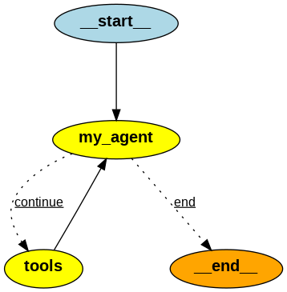

# Personal Assistant

Personal assistant project is a ReAct-style AI that plans, acts, and iterates to answer real-world questions by orchestrating a simple state graph in LangGraph. The agent discovers and invokes tools dynamically from Model Context Protocol (MCP) servers (local or remote), keeping capabilities modular and extensible while grounding responses in fresh, tool-provided data.

## System Architecture

An agent is an LLM-driven program that takes a user goal, decides what to do next, and (optionally) uses external tools/APIs to complete the task before returning a result. Unlike a plain chat model, an agent plans, executes tool calls, observes results, and iterates until it can answer or decides it’s done.

Our personal assistant is a `ReAct` agent. ReAct (Reason + Act) is a control pattern where the model alternates between reasoning/planning (deciding the next best step) and acting (invoking a tool). It observes the tool’s output to inform the next step. ReAct is well-suited for personal assistants because it keeps decisions grounded in real data from tools (search, stocks, weather, calendars, etc.) and can iteratively refine the plan.

Tools are discovered from one or more MCP servers. MCP provides a standard way to list tool schemas and call them over supported transports. Any MCP-compatible server (local or remote) can publish tools; the agent consumes them the same way. Tool hosting, authentication, rate limits, and auditing live beside the tool. Refer to [Home MCP](https://github.com/ManiAm/home-MCP) project for more details.

We model the assistant as a simple state graph in LangGraph: the flow begins at `__start__`, cycles between `my_agent` and `tools` as needed, and finishes at `__end__` once a final answer is ready. LangGraph cleanly orchestrates this loop, keeps the interaction predictable, and makes the overall behavior easy to visualize and maintain.

Here is a brief explanation:

- `__start__`: Begins when a user asks something. The request is captured, the conversation context is set, and the assistant is primed to decide the next best step.

- `my_agent` (LLM planning/decision): The assistant reviews the conversation so far and chooses what to do next: either answer directly, refuse if inappropriate, or select a tool it believes will help produce a better answer.

- `tools` (action and observation): A chosen tool is run and its result is summarized back into the conversation. Control returns to the assistant, which uses the new information to plan the next move. This loop continues until the assistant is confident it can conclude.

- `__end__`: The assistant delivers a final, user-ready answer and the interaction cleanly completes.

We chose [Streamlit](https://streamlit.io/) as our Web UI because it gives us a clean, reactive interface for the personal assistant with almost no boilerplate and all in Python. Its widgets and session state make chat flows, tool parameters, and conversation memory straightforward, while live reload and caching let us iterate quickly.

## Getting Started

Go to the `agent` folder:

    cd agent

Open `config.py` and verify all URLs resolve and are reachable from inside the container

Build and start services:

    docker compose up -d --build

Open the personal assistant web interface:

    http://localhost:8502/
